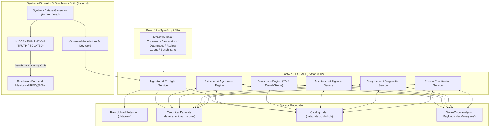

# DataQual v4 — Architecture & System Design

This document details the software architecture, data flow, storage contracts, and strict ground truth isolation boundaries of DataQual v4.

## 1. System Architecture

## 2. Strict Isolation Boundary

- **Production API & UI**: Can only access `observed_annotation_events` and `development_gold`.
- **Hidden Ground Truth**: Resides strictly inside `HiddenGroundTruth` schemas and is NEVER exposed through REST endpoints (`/api/v1/review-runs`). Leakage unit tests verify 100% invariance to modifications of hidden truth.
