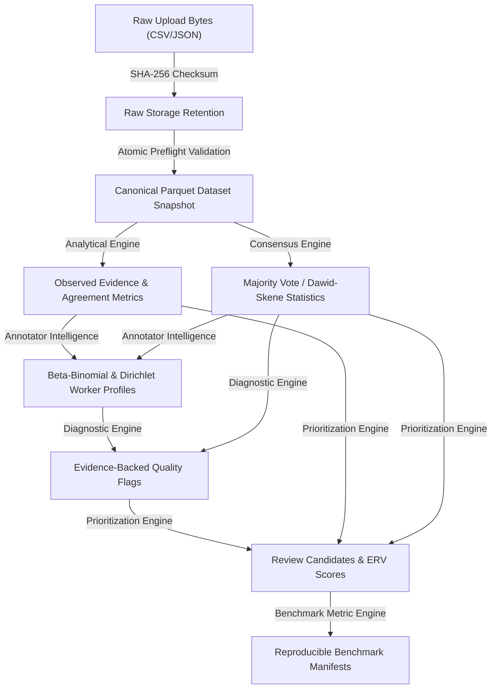

# DataQual v4 — RC1 Provenance Audit

This document traces the complete evidence chain in DataQual v4 from raw source ingestion to review prioritization and benchmark manifest generation.

## 1. End-to-End Evidence Chain Trace

## 2. Representative Trace Example

- **Input File**: `p5_test.csv` (SHA-256: `a93f...`)
- **Canonical Snapshot**: `ds_b96d...` (`data/canonical/datasets/ds_b96d.../data.parquet`)
- **Analysis Run**: `run-20260810-001`
- **Consensus Run**: Majority Vote + Dawid-Skene Reference (`converged: true`, `iterations: 6`)
- **Quality Flag**: `flag-item_0001` (`flag_type: probable_ambiguity_policy_issue`, `support_n: 4`)
- **Review Candidate**: `cand-erv-a_000001` (`rank: 1`, `score: 0.4280`, `components: {u_i: 0.35, h_i: 0.81, e_i: 0.25}`)
- **Benchmark Manifest**: `manifest_s1_10seeds.json` (SHA-256: `c81e...`)

All evidence items retain explicit hash links, algorithm versions, stopping reasons, and timestamp provenance.
